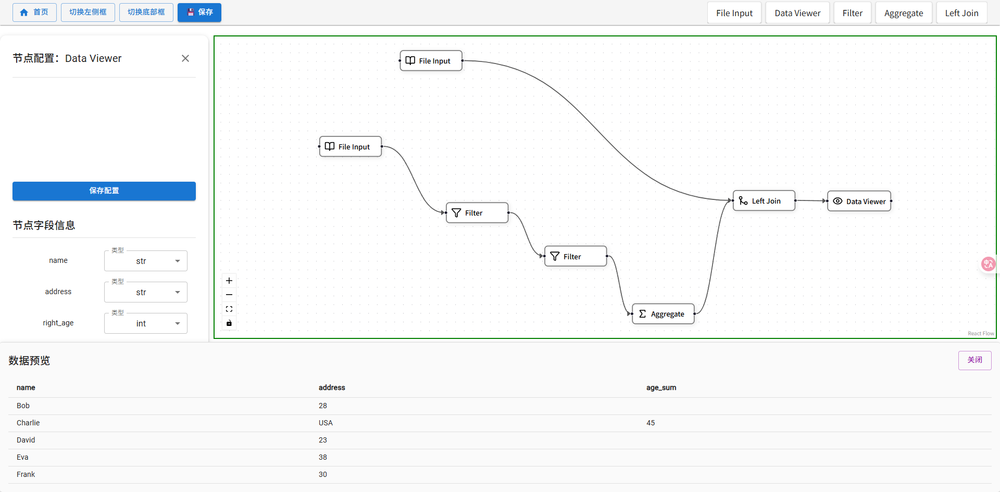
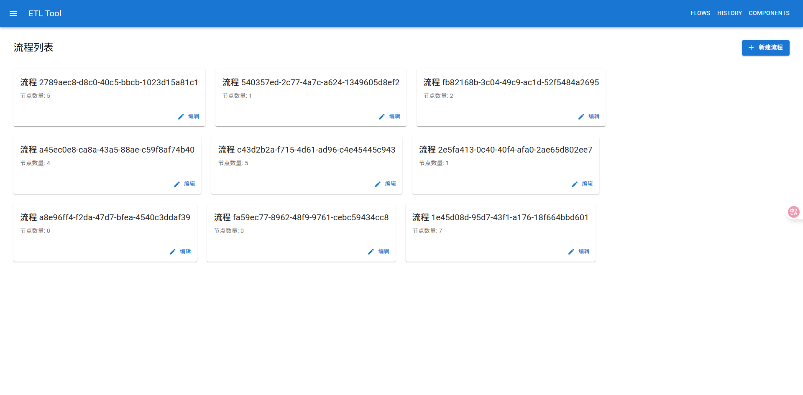

------

# 🛠️ ETL Flow Builder

A powerful, visual ETL (Extract-Transform-Load) tool built with **React**, **React Flow**, **Material-UI**, and a **Python Flask** backend. Design and manage complex data pipelines with a user-friendly interface and DAG-based execution.

------

## 📸 Preview

> 
> 
## 📸 Structure



------

## 🚀 Features

### 🔄 Flow Management

- Create, edit, and delete ETL flows
- Flow version history and versioning
- Real-time configuration and validation

### 🧩 Node System

- Modular nodes for various ETL operations:
  - File Input
  - Data Viewer
  - Filter
  - Left Join
- Custom node configuration panels
- Node connection validation and schema enforcement

### ⚙️ Data Processing

- DAG-based flow execution
- Schema propagation and management
- Preview intermediate data at any node
- Configuration validation before execution

------

## 🧱 System Architecture

### 🖥️ Frontend

- **Framework:** React + TypeScript
- **Visualization:** [React Flow](https://reactflow.dev/)
- **UI Library:** [Material-UI (MUI)](https://mui.com/)
- **Engine Library:** [Polars](https://github.com/pola-rs/polars)
- **Core Components:**
  - `FlowList`: Dashboard for managing flows
  - `Designer`: Drag-and-drop interface for building flows
  - `History`: View and restore previous versions
  - Custom Node UI and Config Panels

### 🔧 Backend

- **Framework:** Python + Flask
- **Database:** SQLite (via SQLAlchemy ORM)
- **API:** RESTful endpoints for flow and node operations
- **Core Services:**
  - `FlowService`: Handles flow CRUD and metadata
  - `NodeService`: Manages node lifecycle and configurations
  - `ETLService`: Executes DAGs and manages schema propagation

------

## 🧬 Data Models

```
Flow    ──>  stores flow structure and metadata
Node    ──>  represents each ETL operation
Config  ──>  holds node-specific configuration
Schema  ──>  manages and validates data schema
```

------

## 🔒 State & Validation

- Node configuration status tracking
- Flow validation before execution
- Schema-aware transformations and previews
- UI-managed configuration state

------

## 🛠️ Tech Stack

| Layer        | Technology                         |
| ------------ | ---------------------------------- |
| Frontend     | React, TypeScript, React Flow, MUI |
| Backend      | Polars, Python, Flask, SQLAlchemy          |
| Database     | SQLite                             |
| Architecture | REST API + DAG Executor            |


------

## 📦 Getting Started

### 🔧 Prerequisites

- Node.js (v16+)
- Python (v3.8+)
- pipenv or virtualenv

### 🖥️ Frontend Setup

```
cd frontend
npm install
npm run dev
```

### 🐍 Backend Setup

```
cd backend
pipenv install
pipenv run flask run
```

------

## 📁 Project Structure

/frontend
  ├── components/
  ├── pages/
  └── utils/

/backend
  ├── services/
  ├── models/
  └── api/


## ✅ TODO
 Add drag-and-drop node templates

 Export/import flows as JSON

 Add user authentication

 Improve large-flow performance

 Support remote database sources


## 📄 License
This project is licensed under the MIT License.


## 🤝 Contributing
Contributions are welcome! Please open issues or submit pull requests to improve functionality or documentation.
