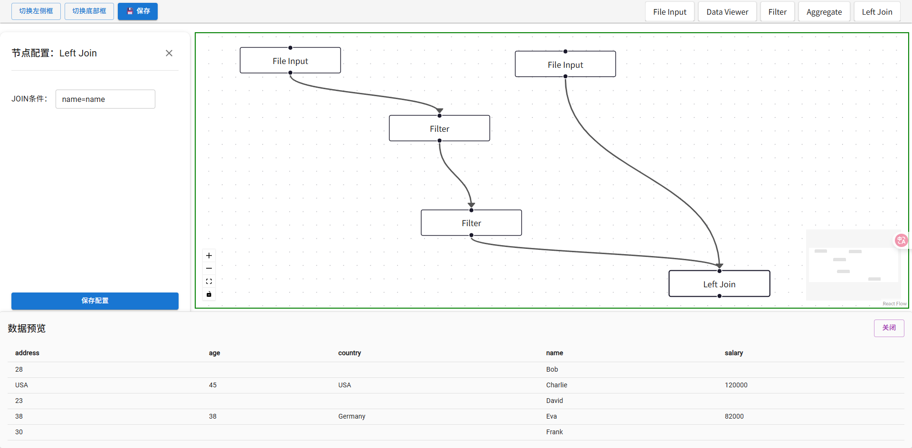

change log:

现有页面抽取成一个FLOW_DESIGN页面

添加一个FLOW_LIST列表页面，作为项目的初始页面，列表上方有个新增按钮，点击新增后，生成一个随机的FLOW_ID，然后跳转到FLOW_DESIGN页面，并且将FLOW_ID带过去。

拖拽可选操作到下部画布，删除，添加连线，发送到后端的时候都要带上FLOW_ID，保存的时候也要带上。

FLOW_DESIGN页面添加一个SAVE按钮，点击按钮，并且将FLOW_ID和当前画布这个FLOW的所有信息发送给后端保存到flows.txt，后续可以直接从flows.txt中读取出来显示到页面中。

FLOW LIST列表页面打开后，从flows.txt中读取简介信息显示到列表，选择一条记录点击末尾的编辑按钮，从后端查询到这个flow的完整信息，渲染到画布中。

File Input组件

Data Viwer组件

Filter组件

Left Join组件

我的ETL TOOL，前端REACT 和REACT FLOW和MUI，后端PYTHON FLASK。
首页我想设置一个导航栏，可以查看已经建立好的FLOW列表，后期还可以查看FLOW的历史版本，自定义组件等。显示Designer页面的时候是全屏幕，不需要显示导航栏，其他页面有导航栏并且选择显示或者隐藏。帮我修改下，并且创建一些组件来占位方便我后续开发。

PolarsBackend

<!-- todo -->
<!-- POLASR backend -->

